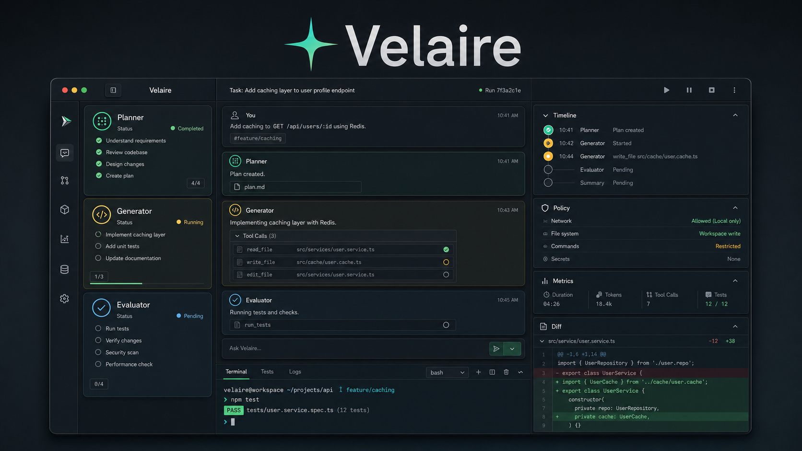

# Velaire

<p align="center">
  
</p>

<p align="center">
  <a href="./docs/assets/velaire-workbench-demo.mp4">Watch the Workbench demo video</a>
  ·
  <a href="./README.zh.md">中文 README</a>
  ·
  <a href="./docs/architecture.md">Architecture</a>
  ·
  <a href="./docs/workbench.md">Workbench</a>
</p>

Velaire is a local-first Bun + TypeScript agent runtime for building coding agents and other tool-using agents. It combines a policy-aware runtime, provider adapters, composable presets, an Ink terminal UI, and a React Visual Workbench powered by the same runtime event protocol.

The current product focus is a coding agent: workspace search and editing, shell execution, approval gates, task planning, multi-agent coding harness experiments, run logs, and a browser workbench for inspecting what the agent is doing while it runs.

## Highlights

- **Dual interface design**: use the Ink TUI for terminal-first workflows or the React Workbench for visual debugging.
- **Unified runtime events**: model output, tool calls, approvals, policy decisions, file changes, metrics, and orchestration phases flow through a shared `RuntimeEvent` model.
- **Visual agent workbench**: conversation, agent lanes, timeline, inspector panels, policy reasons, metrics, artifact cards, and code diff previews.
- **Coding-oriented tool pipeline**: tools are validated, policy-checked, optionally approved, executed, summarized, appended back into transcript, and emitted to UI.
- **Human-in-the-loop by default**: risky writes, shell commands, destructive operations, and user questions are surfaced as approval or question cards.
- **Local run logs**: workbench runs are persisted as JSONL so sessions can be inspected and replayed.
- **Composable presets**: presets package prompt, tools, skills, middleware, policy profile, and UI hints for a specific workflow.

## Quickstart

### Install from source

```bash
git clone <repo-url> velaire
cd velaire
bun install
bun run build:bin
```

The package exposes a `velaire` executable after `bun run build:bin`. During local development, use `bun run dev` or `bun index.ts`.

### Try the Web Workbench demo

Demo mode does not need an API key. It uses built-in sample events so you can inspect the Workbench UI immediately.

```bash
bun install
bun run build:workbench
bun index.ts workbench --port 4897 --demo
```

Open:

```text
http://127.0.0.1:4897
```

The demo video above was recorded from this Workbench path. If GitHub does not render the MP4 inline in your browser, open the video link directly.

### Run with a real model

Configure a provider first:

```bash
bun index.ts config model add
bun index.ts config model list
bun index.ts config model set-default <name>
```

Then start the Workbench from the project you want the agent to operate on:

```bash
cd path/to/project
bun index.ts workbench --port 4897
```

Important: `--demo` always uses sample responses. Remove `--demo` when you want real model calls and real runtime events.

### Use the terminal UI

```bash
cd path/to/project
bun index.ts
```

After building the binary:

```bash
./dist/bin/velaire
./dist/bin/velaire workbench --port 4897
```

## CLI Basics

### Configure a model

Velaire stores user configuration in `${VELAIRE_HOME:-~/.velaire}/config.yaml`.

```bash
velaire config model add
velaire config model list
velaire config model set-default <name>
velaire config model remove <name>
```

A minimal config looks like:

```yaml
version: 1
defaultModel: claude
agent:
  defaultPreset: coding
models:
  - name: claude
    provider: anthropic
    model: claude-sonnet-4-6
    apiKey: ${ANTHROPIC_API_KEY}
    baseURL: null
    options:
      maxTokens: 4096
settings:
  permissions:
    allow: []
    deny: []
```

Use `VELAIRE_HOME` to isolate configs:

```bash
VELAIRE_HOME=/tmp/velaire-home velaire config model list
```

### Non-interactive run

Use `run` for scripts and CI-friendly smoke checks:

```bash
velaire run --provider mock --preset research-lite --prompt "Summarize this workspace"
```

Current non-interactive mock support is useful for smoke tests. Real providers are resolved from saved model config.

## Presets

Presets compose system prompt, tools, skills, policy profile, middleware, and UI hints.

- `coding`: the default code-task preset with workspace tools, shell, todo, ask-user, approval, skills, and timeline support.
- `research-lite`: a read-oriented preset proving the runtime is not hardcoded to coding-only workflows.

Run a preset explicitly:

```bash
velaire --preset coding
velaire run --provider mock --preset research-lite --prompt "Create a brief research plan"
```

## Skills

Skills are Markdown instruction bundles with `SKILL.md` frontmatter. Built-in skills include:

- `coding-plan`
- `deep-research-plan`

Discovery order covers project, Velaire home, legacy agent locations, and built-ins:

```text
${workspace}/.agents/skills
${workspace}/.velaire/skills
${VELAIRE_HOME}/skills
~/.agents/skills
~/.velaire/skills
./skills
```

Slash commands can explicitly trigger skills when the active UI supports them.

## Permissions

Every tool declares capabilities such as `workspace.read`, `workspace.write`, `shell.execute`, `network.read`, `network.write`, `external.side_effect`, `destructive`, `user.interaction`, or `planning`.

The policy engine evaluates tool name, capabilities, inputs, affected paths, preset, and settings. Defaults are conservative:

- Read-only workspace tools are allowed.
- Writes, shell commands, external side effects, and destructive actions ask for approval.
- Writes outside the workspace are denied.
- Project-level always-allow permissions are stored under `.velaire/settings.json`.
- Local-only grants belong in `.velaire/settings.local.json`.

## Architecture

```text
Provider adapter
  -> normalized model events
  -> runtime loop
  -> tool schema parsing
  -> policy + approval
  -> tool execution
  -> transcript append
  -> RuntimeEvent stream
  -> TUI / Web Workbench / JSONL run log
```

Primary layers:

- `src/foundation`: stable message, event, tool, result, and error contracts.
- `src/runtime`: generic agent loop, transcript/session handling, middleware, timeline, and tool orchestration.
- `src/policy`: capability decisions, approval persistence, risk metadata, and redaction.
- `src/tools`: reusable workspace, shell, todo, coding, and user-interaction tools.
- `src/providers`: Anthropic, OpenAI-compatible, mock, and provider registry code.
- `src/presets`: prompt, tools, skills, middleware, policy, and UI hint composition.
- `src/cli`: Commander entrypoint, config commands, first-run wizard, and TUI.
- `src/workbench`: Bun HTTP server, SSE sessions, and React Workbench client.

## Development

```bash
bun install
bun run check:types
bun run lint
bun test
bun run check
bun run build:bin
bun run build:workbench
```

Install the local pre-commit hook path once per clone:

```bash
bun run hooks:install
```

`bun run check` is the main quality gate and runs typecheck, lint, and tests.

## Documentation

- [Architecture](./docs/architecture.md)
- [Foundation](./docs/foundation.md)
- [Runtime](./docs/runtime.md)
- [Tools](./docs/tools.md)
- [Providers](./docs/providers.md)
- [Policy](./docs/policy.md)
- [UI](./docs/ui.md)
- [Workbench](./docs/workbench.md)
- [Skills](./docs/skills.md)
- [Code convention](./docs/code-convention.md)

## Release Checks

Before publishing or tagging a release:

1. Run `bun install --frozen-lockfile` from a clean checkout.
2. Run `bun run check`.
3. Run `bun run build:bin` and confirm `dist/bin/velaire` exists.
4. Smoke test `velaire --help`, `velaire --version`, `velaire config model list`, and a `velaire run --provider mock ...` command.
5. Confirm docs match current CLI commands, config schema, presets, skills, permissions, and `VELAIRE_HOME` behavior.
