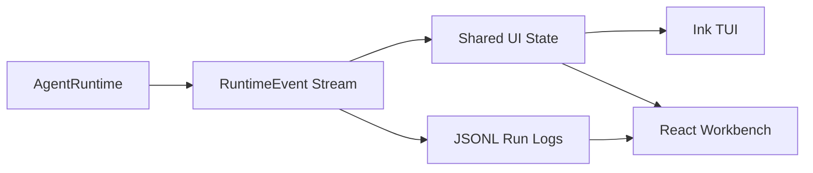

# UI / 用户界面

The Velaire UI should render runtime state from events, not infer behavior from raw transcripts or provider payloads.

## Data flow

```text
Runtime events -> shared UI state reducer -> TUI ViewModel / Web Workbench state -> UI components
```

The reducer/view-model boundary is the main testing surface.

## Dual UI architecture

Velaire exposes two interaction surfaces:

- Ink TUI for keyboard-first terminal workflows.
- React Workbench for visual debugging, run replay, tool inspection, code diffs, and future multi-agent lanes.

Both UIs consume `RuntimeEvent` through `src/ui-state`. The TUI adds terminal-specific view models; the Workbench adds browser layout and inspector selection state.



## Layout targets

A complete TUI should include:

- header with project, preset, model, and mode
- message history with markdown rendering
- tool use and tool result summaries
- approval prompt with risk details
- ask-user prompt
- todo/plan panel
- timeline/risk panel
- input box
- footer with token usage, step count, tool count, and status

The Web Workbench should include conversation, agent lanes, timeline, tool inspector, policy panel, transcript viewer, metrics, and code diff visualization.

## Slash commands

Required commands:

- `/clear`
- `/help`
- `/exit`
- `/quit`
- skill slash commands

Target commands as the timeline and preset systems mature:

- `/timeline`
- `/todos`
- `/skills`
- `/preset`

## Approval rendering

Approval should show the user why a tool needs permission:

```text
Tool: bash
Command: bun run check
Risk: medium
Reversible: yes
Blast radius: workspace
Reason: executes project validation command
Suggested guard: review output before further writes
```

Actions should include allow once, always allow in project, and deny when supported by policy persistence.

## Timeline rendering

Timeline should show safe explanations only: what happened, affected paths, risk, reversibility, and next status. Do not render hidden chain-of-thought.

## Testing

Prefer reducer and view-model tests for:

- text deltas updating the active assistant message
- tool started/completed state
- approval requested/resolved state
- todo snapshot updates
- timeline item additions
- token usage footer updates
- slash command registry behavior
